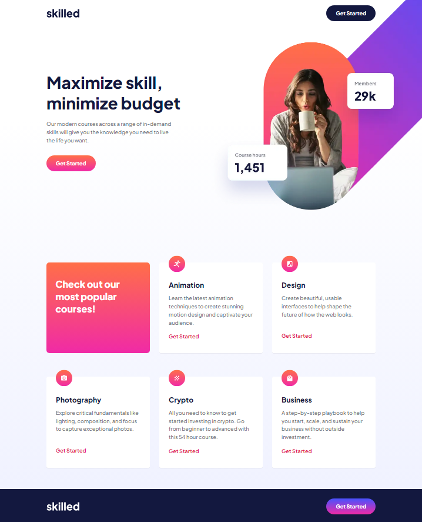

 # Frontend Mentor - Skilled e-learning landing page

This is a solution to the [Skilled e-learning landing page challenge on Frontend Mentor](https://www.frontendmentor.io/challenges/skilled-elearning-landing-page-S1ObDrZ8q). Frontend Mentor challenges help you improve your coding skills by building realistic projects.

### Screenshot

- Live Site URL: https://taavi80.github.io/skilled-elearning-landing-page/

### Built with
- SCSS
- CSS custom properties
- CSS Grid
- Flexbox

## Author
- Website - [taavi80](https://www.frontendmentor.io/profile/taavi80)

